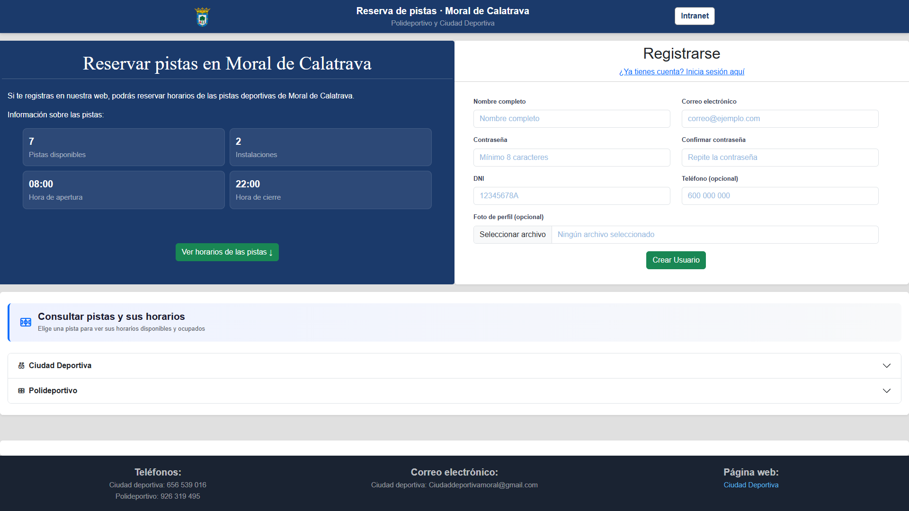
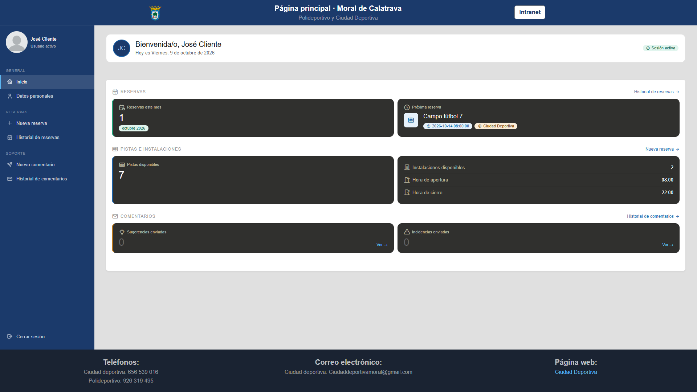
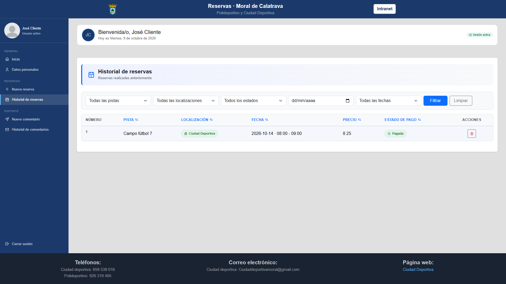
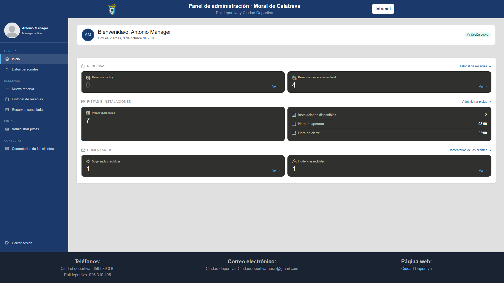
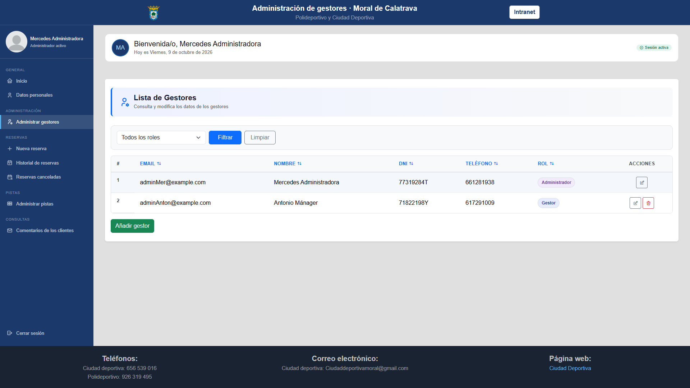
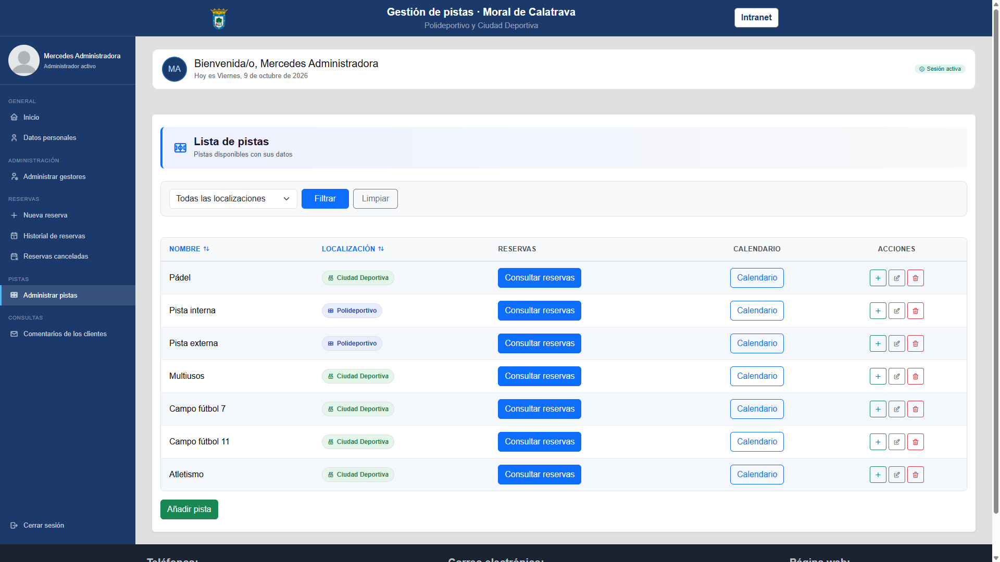
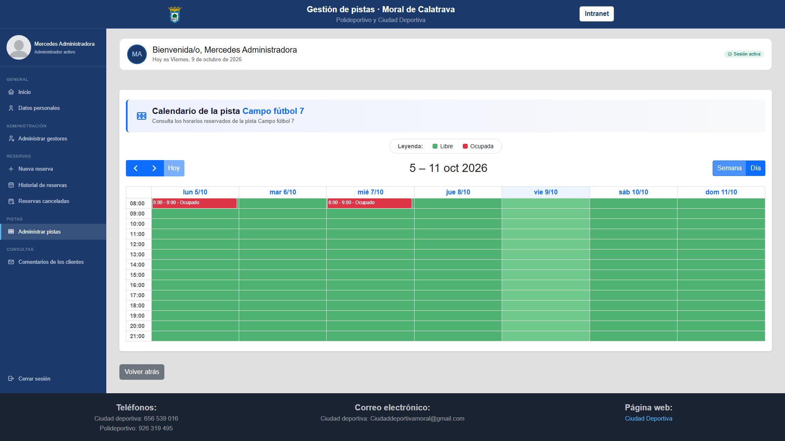

# Sports Court Booking

[](https://github.com/joseignaciosegovia/sports-court-booking/actions/workflows/tests.yml)

Aplicación web para reservar pistas deportivas de un municipio (Moral de Calatrava). Los clientes reservan y pagan online, y el personal gestiona pistas, reservas y cancelaciones desde una intranet. Es un proyecto de portfolio: no está desplegado en producción.

## Funcionalidades

**Cliente**
- Registro con verificación de correo y consulta pública de horarios por pista.
- Reserva de franjas de una hora con pago mediante Stripe Checkout.
- Historial de reservas, cancelación (con reembolso si faltan más de 12 horas) y reanudación del pago.
- Envío de sugerencias e incidencias, y edición del perfil.

**Gestor**
- Calendario por pista con creación rápida de reservas y reprogramación arrastrando.
- Alta, edición y cancelación de reservas, con reembolso y aviso por correo al cliente.
- CRUD de pistas y consulta de comentarios de los clientes.

**Administrador**
- Todo lo del gestor, más el alta, edición y baja de gestores y administradores.

## Tecnologías

- PHP y Laravel, con Livewire y Volt para la autenticación
- Blade, Bootstrap 5 y Vite; FullCalendar para los calendarios
- Stripe (Checkout, webhooks y reembolsos)
- SQLite (por defecto) o MySQL
- PHPUnit, Mockery y GitHub Actions

## Capturas

<table>
  <tr>
    <td><br><sub>Inicio y registro</sub></td>
    <td><br><sub>Panel del cliente</sub></td>
  </tr>
  <tr>
    <td><br><sub>Historial de reservas del cliente</sub></td>
    <td><br><sub>Panel del gestor</sub></td>
  </tr>
  <tr>
    <td><br><sub>Administración de gestores</sub></td>
    <td><br><sub>Gestión de pistas</sub></td>
  </tr>
  <tr>
    <td colspan="2" align="center"><br><sub>Calendario de una pista</sub></td>
  </tr>
</table>

## Instalación

```bash
git clone https://github.com/joseignaciosegovia/sports-court-booking.git
cd sports-court-booking
composer install
npm install && npm run build
cp .env.example .env
php artisan key:generate
touch database/database.sqlite      # en PowerShell: New-Item database\database.sqlite
php artisan migrate --seed
php artisan storage:link
php artisan serve
```

Para probar los pagos, rellena en `.env` las claves de **modo test** de Stripe (`STRIPE_KEY`, `STRIPE_SECRET`, `STRIPE_WEBHOOK_SECRET`) y reenvía los eventos con `stripe listen --forward-to localhost:8000/stripe/webhook`.

El comando `php artisan reservations:cancel-expired` cancela las reservas pendientes caducadas y está programado cada minuto (`php artisan schedule:work` en local).

## Usuarios de prueba

Tras `php artisan migrate --seed` (credenciales de demostración):

| Rol | Email | Contraseña |
|---|---|---|
| Administrador | adminMer@example.com | admMer12 |
| Gestor | adminAnton@example.com | admAn123 |

- La intranet (gestores y administradores) está en `/intranet/login`.
- Los clientes se crean desde el formulario de la página de inicio.
- Los gestores se crean desde "Administrar gestores".

## Testing

La aplicación tiene una suite automatizada de **359 tests (más de 1000 aserciones) con un 93,6 % de cobertura de líneas**, que se ejecuta en GitHub Actions en cada push y pull request.

```bash
php artisan test                      # toda la suite
php artisan test --filter=NombreTest  # un archivo o test concreto
php artisan test --coverage           # cobertura (requiere Xdebug o PCOV)
```

Los tests usan SQLite en memoria y **no llaman nunca a servicios externos**: Stripe se sustituye con dobles de prueba (Mockery) y los correos con `Mail::fake()`, así que no hacen falta claves.

### Qué se prueba

| Área | Qué cubren los tests |
|---|---|
| **Roles y acceso** | Matriz de permisos para invitado, cliente, gestor y administrador; redirecciones al login correcto de cada zona |
| **Reservas (cliente)** | Validación, solapamientos totales y parciales, horario de apertura y cierre (incluidos los límites 08:00 y 21:00-22:00), reservas caducadas y canceladas |
| **Pagos con Stripe** | Creación de la sesión de Checkout, webhook con firma válida e inválida, idempotencia, pagos tardíos, reanudación del pago |
| **Cancelaciones y reembolsos** | Reembolso con más de 12 h de antelación, cancelación tardía, fallo de Stripe, protección contra el doble clic |
| **Panel del gestor** | Crear, editar, reprogramar y cancelar reservas; calendario y endpoints JSON; CRUD de pistas |
| **Administración** | CRUD de gestores, un admin no puede borrarse ni quitarse su propio rol, alcance limitado a gestores y administradores |
| **Usuarios** | Registro (DNI válido y único, rol forzado a cliente), perfil, cambio de contraseña, login con límite de intentos |
| **Infraestructura** | Comando de caducidad de reservas y su programación, renderizado de los correos |

### Bugs reales encontrados gracias a los tests

Escribir los tests destapó fallos que no se veían a simple vista. Estos son los más relevantes:

1. **Reserva huérfana si Stripe fallaba.** Se creaba la reserva `pending` y, si Stripe daba error, quedaba bloqueando el hueco. Ahora se borra al fallar.
2. **Pagos tardíos que resucitaban reservas canceladas.** Si el cliente pagaba desde una pestaña de Stripe abierta después de cancelar, el webhook marcaba la reserva como `paid` y podía haber dos reservas pagadas en la misma franja. Ahora el webhook solo acepta pagos sobre reservas `pending` y reembolsa automáticamente el resto.
3. **Doble reembolso y reservas ya reembolsadas.** Cancelar una reserva reembolsada la dejaba como cancelada y perdía su estado. La cancelación ahora usa transacción, `lockForUpdate()` y una clave de idempotencia en Stripe.
4. **Solapamientos sin comprobar.** El servicio de creación de reservas del gestor perdió la comprobación de solapamiento al añadir otras reglas, y permitía dos reservas en la misma pista y hora. Además, editar o reprogramar una reserva chocaba consigo misma.
5. **Desajuste de tiempos.** La reserva caducaba a los 15 minutos, pero la sesión de Stripe duraba 30, lo que permitía pagar un hueco ya liberado a otro cliente.
6. **Errores 500 por datos de entrada.** DNI duplicado, tipo de comentario inventado (el cast del enum lanzaba `ValueError`), creación rápida sin texto en una columna `NOT NULL`, o reutilizar el nombre de una pista borrada con soft delete.
7. **Permisos incompletos.** Un admin podía editar o borrar clientes desde la zona de gestores y borrarse a sí mismo; un cliente podía ver las pantallas de pago de otro.
8. **Redirección de login incorrecta.** Las rutas `/administrador/*` enviaban a los invitados al login de clientes, porque el middleware comprobaba `admin/*` en vez del prefijo real.
9. **Login de la intranet sin límite de intentos** y con el checkbox «Recordar cuenta» enlazado a una propiedad inexistente.
10. **Autores dados de baja.** El listado de comentarios del gestor daba un 500 si el cliente había sido borrado (soft delete).

### Decisiones de diseño relacionadas con los tests

- Las llamadas estáticas a Stripe (`Session::create`, `Refund::create`) se aíslan en métodos `protected` para poder sustituirlas sin tocar el resto del servicio.
- Las reglas de negocio viven en servicios (`ReservationCheckoutService`, `ReservationCancellationService`, `StripeWebhookService`), de modo que se prueban por separado de los controladores.
- Las factories incluyen estados con nombre (`paid()`, `canceled()`, `expired()`, `withoutUser()`) para que los tests se lean como reglas de negocio.

### Fuera del alcance de la suite

No se prueban el JavaScript del calendario (FullCalendar), las llamadas reales a la API de Stripe ni la ejecución del scheduler en un servidor.